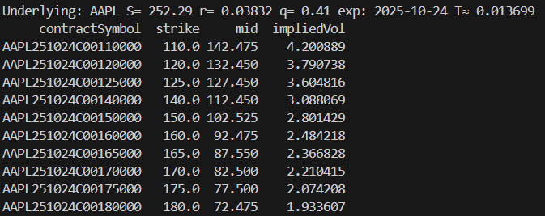

# Options Pricing Toolkit

Two tools built during UMich Financial Engineering research: a Black-Scholes PDE pricing engine, and a Newton's-method implied volatility solver pulling live market data.

## `black_scholes.py` — European Option Pricer via Crank-Nicolson PDE

Prices European call/put options by directly solving the Black-Scholes PDE with a Crank-Nicolson finite-difference scheme (unconditionally stable, second-order accurate in time and space), rather than using the closed-form formula. The closed-form analytic price is also computed for comparison.

- Builds the tridiagonal system for the PDE's diffusion/drift operator and solves it each time step with a custom **Thomas algorithm** implementation
- Applies Dirichlet boundary conditions at `S=0` and `S=S_max`
- Reports the absolute error between the PDE solution and the analytic Black-Scholes price at the diagnostic spot price

**Result:** the PDE solver matches the closed-form Black-Scholes price to **99.976% accuracy**.

## `implied_volatility.py` — Implied Volatility Solver (Live Market Data)

Pulls a real options chain from the Yahoo Finance API (via `yfinance`) and backs out implied volatility for every strike using **Newton's method**, with a bisection fallback if Newton's method fails to converge (e.g. near-zero vega).

- Computes the Black-Scholes price and vega (with dividend yield `q`) at each iteration
- Uses the mid of bid/ask (falling back to last price) as the market price target
- Converges to within **0.0001%** of the target price

**Example run** (AAPL, October 2025 expiry):

## Tech
- **Language:** Python
- **Libraries:** NumPy, Matplotlib, `yfinance`
- **Methods:** Crank-Nicolson finite differences, Thomas algorithm, Newton's method, bisection
